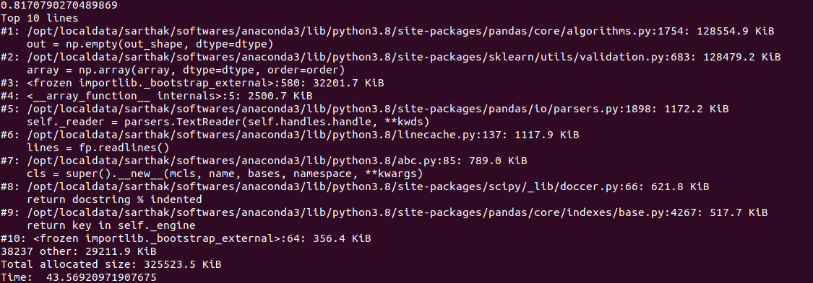

# BMI500_Satpathy_GMMclustering

This repository contains the code for Homework assignment for BMI-500 course: Week 4 on Introduction to Python programming. The aim of the project was to run an unsupervised clustering algorithm on a choice of publically available dataset. 

## Dataset

The dataset used for this project was obtained from [UCI Machine Learning Repository](https://archive.ics.uci.edu/ml/datasets.php) and is available in the following [link](https://archive.ics.uci.edu/ml/datasets/gene+expression+cancer+RNA-Seq) for the empirical analysis of machine learning algorithms. 
This collection of data is part of the RNA-Seq (HiSeq) PANCAN data set, it is a random extraction of gene expressions of patients having different types of tumor: BRCA, KIRC, COAD, LUAD and PRAD.[1] The data is distributed under a Creative Commons license. Each row in the data stored the patients information.The columns of each sample are RNA-Seq gene expression levels measured by illumina HiSeq platform.

## Installation:

```install
git clone https://github.com/satpathysarthak/BMI500_satpathy_week4.git
cd BMI500_satpathy_week4
```

### Requirements

To install requirements:

```setup
pip install -r requirements.txt
```
This can be done either directly in the cloned repository or by setting up an [Anaconda](https://docs.conda.io/projects/conda/en/latest/user-guide/tasks/manage-environments.html) or Python [virtualenv](https://virtualenv.pypa.io/en/stable/user_guide.html) environment

### Files and Directories
`run.sh`: The shell file that contains the code for running the program

`requirements.txt`: Text file with the list of packages for installation

`pack\`: directory that has `datasets`, `output` and main python file [main.py](https://github.com/satpathysarthak/BMI500_satpathy_week4/blob/main/pack/main.py)

### Running the program

```pipeline
bash run.sh
```
Or conversely 

```pipeline2
cd pack/datasets
tar -xvzf TCGA-PANCAN-HiSeq-801x20531.tar.gz
cd ..
python main.py
```
## Run time and memory requirements

The following is the snippet of the time it took to run the code and memory used in the process:



The program took a total time of 43.57s and memory of 325MB. The step with the maximum memory allocation required 128MB.


## References
1. Weinstein, John N., et al. 'The cancer genome atlas pan-cancer analysis project.' Nature genetics 45.10 (2013): 1113-1120.
2. Tutorial on: [Iris Exploration (PCA, k-Means and GMM clustering) by Brian Burns](https://www.kaggle.com/bburns/iris-exploration-pca-k-means-and-gmm-clustering)
3. Article on: [10 Clustering Algorithms With Python by Jason Brownlee](https://machinelearningmastery.com/clustering-algorithms-with-python/)
